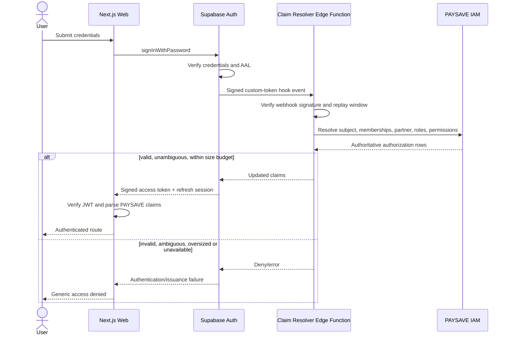
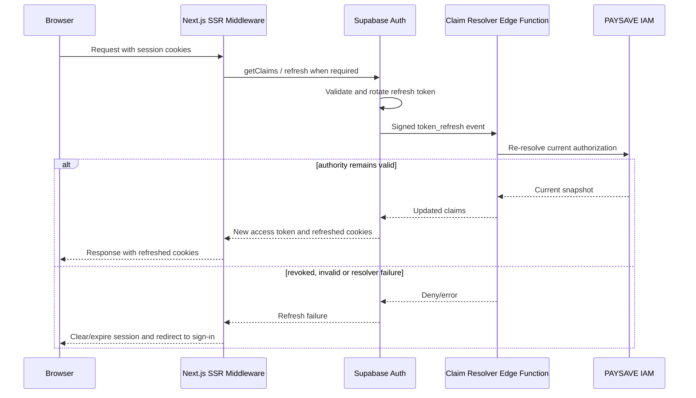
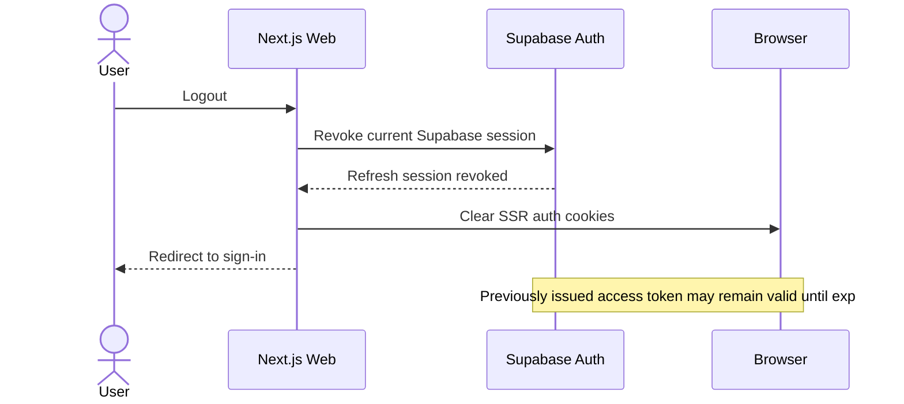
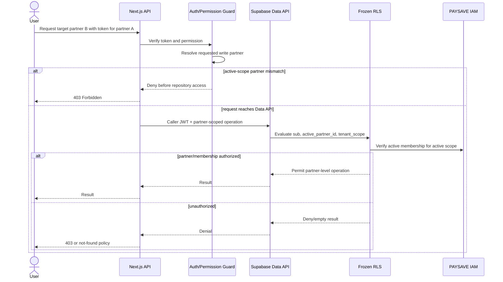
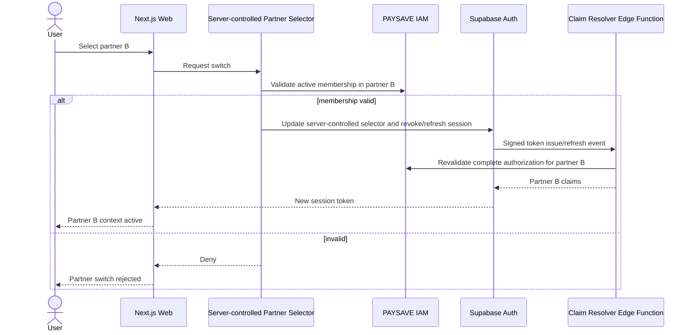

# RFC-0008 — Authentication Sequence Diagrams

- **Status:** FINAL — SEALED FOR CTO DECISION
- **Nature:** Design-only; no deployment or backend change is authorized

## 1. Login



## 2. Refresh



## 3. Logout



## 4. Permission change

```mermaid
sequenceDiagram
  actor Admin
  participant IAMAdmin as IAM Administration
  participant IAM as PAYSAVE IAM
  participant Revoker as Session Revocation Control
  participant Auth as Supabase Auth
  participant UserSession as Affected Session
  participant Hook as Claim Resolver Edge Function

  Admin->>IAMAdmin: Approve role/permission change
  IAMAdmin->>IAM: Persist governed grant/revoke
  IAM-->>Revoker: Authorization-change event or explicit request
  alt removal or urgent reduction
    Revoker->>Auth: Revoke affected refresh sessions
    Auth-->>UserSession: Future refresh denied
    Note over UserSession: Existing access token bounded by exp; sensitive endpoints require fresh check
  else addition or non-urgent change
    Note over UserSession: Effective at next refresh
  end
  UserSession->>Auth: Next permitted refresh
  Auth->>Hook: Signed token_refresh event
  Hook->>IAM: Resolve new authorization
  Hook-->>Auth: New permission snapshot
```

## 5. Cross-tenant request



## 6. Partner switch


