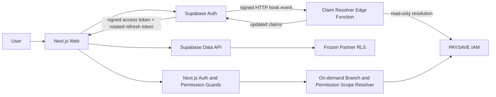

# RFC-0008 — Supabase JWT Claim Integration

- **Status:** FINAL — SEALED FOR CTO DECISION
- **Owner:** Identity & Security Platform Lead
- **Decision authority:** CTO with CISO and Enterprise Architecture review
- **Stage impact:** Stage 4.0 Phase B remains HOLD; Beta Gate remains HOLD
- **Architecture impact:** No frozen logical architecture change proposed
- **Execution authority:** None — this RFC does not authorize implementation or deployment
- **Database impact:** None
- **Production access:** Prohibited

## 1. Decision summary

Adopt **Option D — Hybrid** as the target integration architecture:

1. Supabase Auth remains the identity provider, credential verifier, JWT issuer, refresh-token authority and session revocation authority.
2. A Supabase **HTTP Custom Access Token Hook**, hosted as a dedicated Edge Function, resolves a minimal PAYSAVE claim set from the approved IAM model at token issue and refresh time.
3. The current Next.js authentication adapter verifies the Supabase JWT and strictly parses the existing `paysave` fields into `AuthContext`. The target `claims_version` field in this RFC is **not enforced by the current parser**; implementing version negotiation requires separately authorized application work and is a hard readiness blocker.
4. Frozen database RLS remains authoritative for **partner isolation**, using only `sub`, `paysave.active_partner_id` and `paysave.tenant_scope` as currently implemented.
5. Application permission guards remain authoritative for route/use-case permission checks using `paysave.permissions`.
6. Branch and resource/data-classification scopes are resolved on demand from approved IAM records by server-side application policy. They are not claimed to be enforced by current RLS.
7. Direct browser/PostgREST access is prohibited for any operation whose safety depends on branch, assignment, permission scope, SoD or fresh revocation checks that frozen RLS does not enforce.

This decision uses the frozen infrastructure seam—Supabase adapter behind the modular-monolith boundary—without applying legacy migration `0002_authentication_rbac.sql`, changing M001–M016, creating database objects or accessing Production.

## 2. Evidence baseline

| Evidence                                                       | Observed contract                                                                                               |
| -------------------------------------------------------------- | --------------------------------------------------------------------------------------------------------------- |
| `docs/architecture/FOUNDATION_ARCHITECTURE.md`                 | Supabase belongs in feature infrastructure; server authorization and RLS are layered controls                   |
| `docs/architecture/PAYSAVE_Architecture_Freeze_Report_v1.0.md` | IAM owns identity, membership, roles, permission scope and SoD; runtime policy implementation is not frozen     |
| `database/migrations/stage3_2_batch1/M003_iam.sql`             | `iam.users.auth_subject`, memberships, roles, grants, branch scopes and permission scopes exist                 |
| M003 RLS claim readers                                         | RLS reads `sub`, `paysave.active_partner_id` and `paysave.tenant_scope` only                                    |
| `packages/security/src/auth-context.ts`                        | Application expects roles, permissions, tenant scope, active partner and a positive session version             |
| `apps/web/.../get-auth-context.ts`                             | Supabase `getClaims()` is verified before strict claim parsing                                                  |
| Supabase official Custom Access Token Hook documentation       | Hook runs before token issue; Postgres and HTTP forms are supported; required standard claims must be preserved |

### Superseded instruction

`docs/security/AUTHENTICATION_SETUP.md` lines directing use of migrations `0001/0002` and the legacy database hook conflict with the approved baseline. They are non-authoritative for RFC-0008 and must not be followed.

## Deliverable index

1. [RFC-0008 Supabase JWT Claim Integration](./RFC-0008-supabase-jwt-claim-integration.md)
2. [JWT Claim Specification](./RFC-0008-jwt-claim-specification.md)
3. [Authentication Sequence Diagrams](./RFC-0008-authentication-sequence-diagrams.md)
4. [RLS Claim Mapping Matrix](./RFC-0008-rls-claim-mapping-matrix.md)
5. [Decision Matrix](./RFC-0008-decision-matrix.md)
6. [Risk Register](./RFC-0008-risk-register.md)
7. [Implementation Readiness Assessment](./RFC-0008-implementation-readiness-assessment.md)
8. [Independent Review and Reconciliation Record](./RFC-0008-independent-review-record.md)
9. [CTO Decision Package](./RFC-0008-cto-decision-package.md)

## Scope boundary

### In scope

- Design the identity, claim, refresh, revocation, RLS-integration and operational contracts.
- Compare architecture options and record risks, open questions and approval conditions.
- Define future Staging evidence requirements.

### Out of scope

- Database schema, policy, role or function changes.
- Any edit to M001–M016 or use of legacy migrations.
- Executable database statements or a new migration.
- Backend/application business-logic changes.
- Edge Function implementation, hook configuration or deployment.
- Secret creation, environment mutation or Production access.

## 3. Constraints and invariants

- M001–M016 stay byte-frozen.
- Legacy migrations stay unapplied.
- No database schema, policy, role, function or seed change is authorized.
- Supabase service-role material is server-only and must never reach browser, logs or JWTs.
- A service-role client must never execute a user-context request or be used to represent caller authorization; any future resolver use requires an isolated, audited, read-only contract approved by Security.
- Missing, malformed, oversized, stale or ambiguous claims deny access.
- The JWT is an authorization snapshot, not the system of record.
- IAM records remain authoritative.
- `tenant_scope=all` is never inferred from a role name alone.
- Claim generation must not silently truncate roles or permissions.

## 4. Component architecture

### Trust boundaries

| Boundary                      | Required control                                                                            |
| ----------------------------- | ------------------------------------------------------------------------------------------- |
| Browser → Supabase Auth       | TLS, allowed redirects, rate limits, MFA policy                                             |
| Supabase Auth → HTTP hook     | Standard Webhooks signature verification, replay window, endpoint allowlist                 |
| Hook → IAM                    | Server-only credential, explicit read-only query contract, timeout and fail-closed behavior |
| JWT → Next.js                 | Supabase signature/issuer/audience/expiry verification before PAYSAVE parsing               |
| JWT → Data API                | Supabase verification plus frozen RLS; no service-role substitution                         |
| Application → scoped resource | Permission guard plus fresh branch/resource scope check where required                      |

## 5. Authentication and session lifecycle

### Login

1. User submits credentials to Supabase Auth through the existing server action.
2. Supabase verifies credentials and MFA/AAL policy.
3. Before access-token issuance, Supabase sends a signed HTTP hook event.
4. Resolver maps `user_id` to `iam.users.auth_subject`, requires an eligible user and active membership, resolves the selected partner, roles and effective permissions, then returns the updated claim set.
5. Any missing authority, ambiguous partner choice, unknown role, invalid permission code, timeout or size breach rejects issuance.
6. Supabase issues its signed JWT and refresh token; SSR cookies are managed by `@supabase/ssr`.
7. Next.js verifies and strictly parses claims before route access.

### JWT refresh

- Supabase refresh-token rotation remains authoritative.
- Every refresh invokes claim resolution again; cached values may be used only within the bounded freshness policy.
- A new access token replaces the old authorization snapshot.
- Refresh failure or invalid IAM state signs the user out rather than retaining stale authority.

### Logout

- Current-session logout revokes the Supabase refresh session and clears SSR cookies.
- Existing access tokens may remain cryptographically valid until `exp`; short access-token lifetime bounds this residual window.
- Administrative revocation uses Supabase session revocation plus IAM removal/disable controls.

### Session states

`unauthenticated → authenticated-pending-claims → active → refresh-required → revoked/expired`

No state transition bypasses JWT verification and PAYSAVE claim validation.

## 6. Claim resolution rules

1. Match Supabase `user_id` to exactly one `iam.users.auth_subject`.
2. Require user eligibility according to an approved status vocabulary.
3. Load active, non-deleted memberships.
4. Determine the active partner:
   - one active membership: may auto-select;
   - multiple memberships: use a server-controlled session selector and revalidate membership;
   - no valid selector: issue a fail-closed null partner context or reject, per CTO decision.
5. Load currently effective membership-role assignments.
6. Accept only recognized active roles; unknown values fail closed.
7. Load role permissions; include only explicitly allowed, valid permissions; duplicate codes collapse.
8. Do not embed branch-scope rows or resource IDs in JWT.
9. Compute the serialized claim budget before issuance; never truncate.
10. Return required Supabase standard claims unchanged plus the versioned `paysave` object.

## 7. Refresh and change propagation

| Change                       | Required action                                                                  | Maximum stale window                                                                                                |
| ---------------------------- | -------------------------------------------------------------------------------- | ------------------------------------------------------------------------------------------------------------------- |
| Role added                   | Normal refresh; force refresh for immediate access                               | Access-token lifetime                                                                                               |
| Role removed                 | Revoke affected sessions and refresh; deny at app on fresh check                 | Access-token lifetime unless every request is revalidated                                                           |
| Permission added             | Normal/forced refresh based on urgency                                           | Access-token lifetime                                                                                               |
| Permission removed           | Revoke sessions; high-risk endpoints perform fresh scope check                   | Access-token lifetime                                                                                               |
| Membership removed/suspended | IAM change plus Supabase session revocation                                      | Partner RLS denies immediately only when membership state is changed; global-scope token remains valid until expiry |
| Active partner changed       | Update server-controlled selector, revoke/refresh session, re-resolve all claims | No mixed-partner token reuse permitted                                                                              |
| User disabled                | Disable Auth user, revoke sessions and deactivate memberships                    | Access-token lifetime for controls based only on token                                                              |

## 8. Revocation model

- **Refresh authority:** Supabase session revocation prevents future token refresh.
- **Partner access:** removing/suspending active membership causes frozen `admin.authorized_partner` to deny active-scope access.
- **Permission access:** stale permission claims remain usable until token expiry unless the server performs a fresh authorization check.
- **Global scope:** current frozen RLS trusts `tenant_scope=all`; therefore global-scope issuance remains disabled until a global-authority source and emergency revocation control are approved.
- **Replay:** validate signature, issuer, audience, expiry, session identifier and hook timestamp/signature; sensitive mutations retain idempotency/correlation controls.

## 9. Performance model

- Target one resolver operation per login/refresh, not per ordinary request.
- Resolver query plan should fetch user, memberships, effective roles and permissions in a bounded number of round trips.
- Cache key: Auth subject + active partner + authorization generation.
- Positive-cache TTL target: 30–60 seconds; negative-cache TTL target: at most 5 seconds.
- Removal/revocation events must invalidate affected cache keys; absent event wiring, use the shortest TTL and keep Beta HOLD.
- Resolver budget target: p95 ≤ 150 ms, p99 ≤ 300 ms, hard timeout ≤ 500 ms; timeout denies issuance.
- Branch/resource scope checks may use a separate short cache only after partner and membership validation.

Targets are proposals, not measured evidence.

## 10. Security position

- Claims contain identifiers and authorization codes only; no names, email duplication, phone, ciphertext, financial data, customer data, branch lists or resource IDs.
- Supabase signs the JWT; the application never trusts client-supplied claim JSON.
- Hook requests require signature verification before parsing or lookup.
- Hook registration is not currently evidenced. Implementation acceptance requires deterministic Supabase Auth hook binding/config evidence, a valid issued-token test and explicit fail-closed outage/rollback evidence.
- Broad service-role capability is a material risk; no implementation is ready until credential isolation and a read-only access design receive Security approval.
- `tenant_scope=all` defaults disabled.
- Permission denial overrides allowance where semantics are unambiguous; unresolved `effect` vocabulary fails closed.
- Claim logs include only subject hash/session correlation, version, counts and decision—not tokens or permission values.

## 11. Recommended delivery phases after approval

1. **Contract approval:** settle authority sources, status/effect vocabularies, global admin, selector and TTL.
2. **Threat model:** approve hook identity, credential boundary, replay defense and outage behavior.
3. **Non-Production implementation authorization:** Edge Function and application changes reviewed separately; no database change.
4. **Staging verification:** login, refresh, logout, revocation, cross-tenant denial, stale-token window, hook outage, cache invalidation and token-size tests.
5. **Beta Gate reassessment:** only after operational evidence and independent sign-off.

## 12. Decision

**Recommended:** D — Hybrid, with HTTP Custom Access Token Hook on Edge Function for minimal coarse claims and server-side fresh resolution for fine-grained scope.

**Current disposition:** NOT IMPLEMENTATION READY. RFC is sealed for CTO decision; Stage 4.0 Phase B and Beta Gate remain HOLD.

## 13. Required CTO decisions

1. Approve Option D and Edge Function as an allowed runtime integration component.
2. Define authoritative active-partner selection for multi-membership users.
3. Define authoritative global-admin grant source; otherwise keep `tenant_scope=all` disabled.
4. Approve access-token lifetime and accepted stale-authorization window.
5. Approve role status, membership status and role-permission `effect` vocabularies.
6. Decide whether branch/resource-sensitive traffic must be application-only until a future RLS decision.
7. Approve the hook-to-IAM least-privilege credential model and Secret Manager owner.
8. Approve or reject a future application-contract change to enforce `claims_version`; until then RFC-0008 is not implementation-ready.
9. Confirm `session_version` remains compatibility-only or approve a separately governed authority/comparison design.
